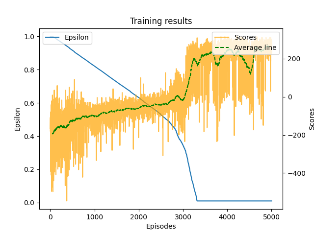
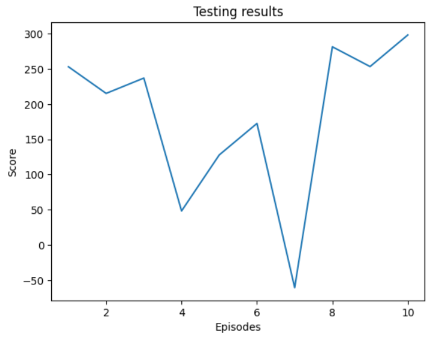

# Lunar-Lander-DRL-Dueling-DoubleDQN (D3QN)
This is a Deep Reinforcement Learning solution for the Lunar Lander problem in OpenAI Gym using dueling network architecture and the double DQN algorithm. The solution was developed in a Jupyter notebook on the Kaggle platform, utilizing the GPU P100 accelerator. You can find the model weights in the model folder and the results in csv format in the results folder.
# Package Requirements 
```python
pip install swig, gym[box2d]
```
# Description of Lunar Lander problem (LunarLander-v2)

<table class="docutils align-default">
  <tbody>
    <tr class="row-even"><td><p>Action Space</p></td>
    <td><p><code class="docutils literal notranslate"><span class="pre">Discrete(4)</span></code></p></td>
    </tr>
    <tr class="row-odd"><td><p>Observation Space</p></td>
    <td><p><code class="docutils literal notranslate"><span class="pre">Box([-1.5</span> <span class="pre">-1.5</span> <span class="pre">-5.</span> <span class="pre">-5.</span> <span class="pre">-3.1415927</span> <span   class="pre">-5.</span> <span class="pre">-0.</span> <span class="pre">-0.</span> <span class="pre">],</span> <span class="pre">[1.5</span> <span class="pre">1.5</span> <span class="pre">5.</span> <span class="pre">5.</span>   <span class="pre">3.1415927</span> <span class="pre">5.</span> <span class="pre">1.</span> <span class="pre">1.</span> <span class="pre">],</span> <span class="pre">(8,),</span> <span class="pre">float32)</span></code></p></td>
    </tr>
    <tr class="row-even"><td><p>import</p></td>
    <td><p><code class="docutils literal notranslate"><span class="pre">gymnasium.make("LunarLander-v2")</span></code></p></td>
    </tr>
  </tbody>
</table>

## Possible actions
<table>
  <thead>
    <tr>
      <th>Action discrete value</th>
      <th>Description</th>
    </tr>
  </thead>
  <tbody>
    <tr>
      <td>0</td>
      <td>No action</td>        
    </tr>    
    <tr>
      <td>1</td>
      <td>Fire left orientation engine</td>        
    </tr>
    <tr>
      <td>2</td>
      <td>Fire main engine</td>        
    </tr>    
    <tr>
      <td>3</td>
      <td>Fire left orientation engine</td>        
    </tr>
  </tbody>
</table>

## Observation Descriptions

|Position in the observation or state space list|Description|
|--|--|
| 0 | Lander horizontal coordinate |
| 1 | Lander vertical coordinate |
| 2 | Lander horizontal speed |
| 3 | Lander vertical speed |
| 4 | Lander angle |
| 5 | Lander angular speed |
| 6 | Bool: 1 if first leg has contact, else 0 |
| 7 | Bool: 1 if second leg has contact, else 0 |

## Reward Descriptions
For each step in the environment, a reward is granted. The total reward for an episode is the sum of the rewards at each step.
For each step, the reward:
- is increased/decreased the closer/further the lander is to the landing pad.
- is increased/decreased the slower/faster the lander is moving.
- is decreased the more the lander is tilted (angle not horizontal).
- is increased by 10 points for each leg that is in contact with the ground.
- is decreased by 0.03 points each frame a side engine is firing.
- is decreased by 0.3 points each frame the main engine is firing.
- -100 for crashing the lander.
- +100 points for landing safely.

<b>An episode is considered a solution if it scores at least 200 points.</b>

## Episode termination conditions
- The lander crashes.
- The lander gets outside of the viewport (x coordinate is greater than 1).
- Episode length > 400.

## Dueling Double DQN solution (D3QN)

<table>
<tr><th> Train </th><th> Test </th></tr>
<tr><td>

| Parameter | Value |
|--|--|
| Number of episodes | 5000 |
| Learning rate  | 0.00015 |
| Discount Factor | 0.99 |
| Epsilon | 1.0 |
| Desired epsilon | 0.01 |
| Epsilon decay | Epsilon - Desired Epsilon / 500,000 states |
| Batch size | 32 |
| Target network update rate (training steps) | 150 |
| Loss function used | HuberLoss |
| Optimizer used | Adam |
| Memory size | 1,000,000 |
| Storage experience size condition for start the training| 5,000 |
| Experience replay strategy | Uniform |

</td><td>

| Parameter | Value |
|--|--|
| Number of episodes | 10 |
| Epsilon | 0.01 |

</td></tr> </table>

**Note: You can experiment with various hyperparameters to achieve improved results.**

## Results

<div align="center">   
  
  
</div>

### Test result video
<p align="center">
  
</p>


